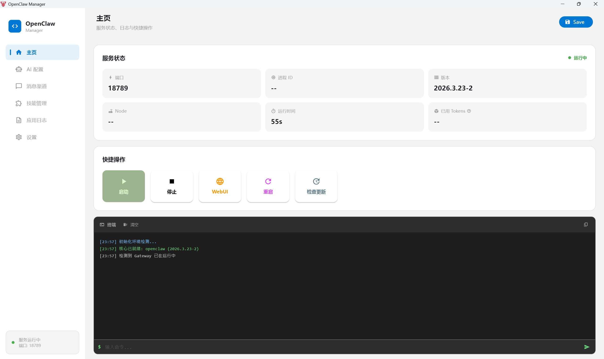
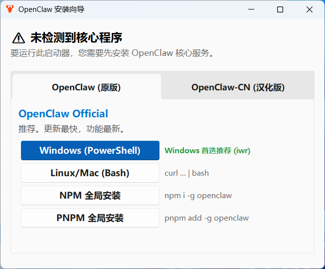
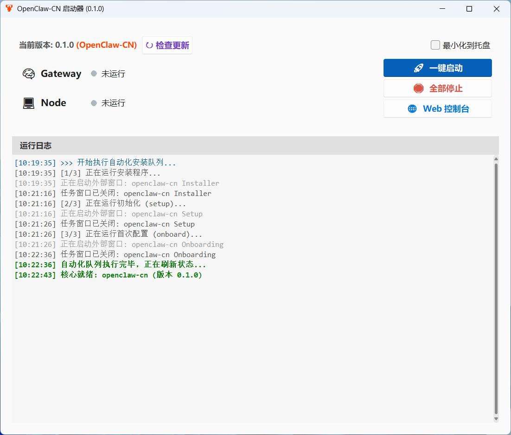

# 🦞 OpenClaw 通用启动器

**OpenClaw Launcher** 是一个专为 [OpenClaw](https://openclaw.ai/) 及其汉化分支 [OpenClaw-CN](https://clawd.org.cn) 设计的图形化管理工具。它旨在简化复杂的命令行操作，为用户提供一站式的安装、部署、监控和管理体验。

无论您是开发者还是普通用户，通过此启动器，无需记忆复杂的 CLI 指令，即可轻松搭建属于您的 AI 算力网络节点。

<div align="center">
  
</div>

---

## ✨ 核心功能

* **双核心支持**：完美兼容 **OpenClaw (原版)** 与 **OpenClaw-CN (汉化版)**，自动识别并适配命令。
* **全自动部署**：独创的“序列化安装队列”，一键完成 `安装` -> `初始化` -> `配置引导` 全流程。
* **可视化监控**：实时红绿灯显示 Gateway 与 Node 的运行状态，日志窗口实时输出后台信息。
* **环境自适应**：
    * 自动修复 VMware/NAS 共享文件夹下的路径报错 (UNC Path Fix)。
    * 智能检测 Node.js 依赖环境。
    * 自动提权（管理员身份运行）。
* **贴心交互**：支持最小化到系统托盘，后台静默运行不打扰。

---

## 📖 使用方法

### 1. 运行环境

本程序基于 Python 开发，如果您运行的是源码版本，请确保安装以下依赖：

```bash
pip install sv-ttk pystray pillow

```

*(如果您下载的是打包好的 `.exe` 文件，则无需安装任何依赖，直接双击运行即可)*

### 2. 首次安装 (向导模式)

1. 启动软件，程序会自动检测系统是否安装了 OpenClaw。
2. 若未检测到核心，会自动弹出 **安装向导**。

<div align="center">

</div>

3. **选择版本**：在顶部标签页选择 **OpenClaw (原版)** 或 **OpenClaw-CN (汉化版)**。
4. **点击安装**：推荐点击绿色的 **Windows (PowerShell)** 按钮。
5. **等待完成**：程序会自动弹出黑色命令行窗口，请按提示完成操作。窗口关闭后，软件会自动刷新状态，显示安装成功。

<div align="center">

</div>

### 3. 日常使用

* **🚀 一键启动**：点击主界面按钮，程序会自动按顺序启动 Gateway 和 Node 服务。
* **🌐 Web 控制台**：服务启动成功（指示灯变绿）后，点击此按钮可直接打开浏览器进入管理后台。
* **🛑 全部停止**：一键关闭所有相关后台进程，释放系统资源。
* **↻ 检查更新**：点击左上角更新按钮，可对比本地与云端版本，并支持一键原地更新。

---

## 🔧 常见问题与解决 (Troubleshooting)

**Q1: 启动时提示 "UNC paths are not supported"？**

> **A:** 这是 Windows 的限制，通常发生在您在 VMware 共享文件夹或网络驱动器中运行程序时。
> **v1.4 版本已修复此问题**。我们强制将命令执行路径指向您的用户主目录，您现在可以在任何位置放心运行启动器。

**Q2: 点击安装按钮后弹窗提示 "未检测到 Node.js"？**

> **A:** OpenClaw 必须依赖 Node.js 运行环境。
> 请点击弹窗中的“是”，前往 Node.js 官网下载并安装 **LTS 版本**。安装完毕后重启启动器即可。

**Q3: 安装过程卡在黑色窗口不动？**

> **A:** 请检查窗口中是否有报错信息。如果是网络下载慢，请尝试切换到 **OpenClaw-CN (汉化版)**，它使用了国内加速镜像源。
> 如果窗口显示 `Press any key to continue...`，说明命令已执行完毕，请按任意键关闭窗口。

**Q4: 为什么我的 PowerShell 窗口一闪而过？**

> **A:** 请确保您使用的是 v1.4 及以上版本。新版本使用了底层的 `CREATE_NEW_CONSOLE` 技术，强制保持窗口可见，确保您能看到安装结果。

```

```
