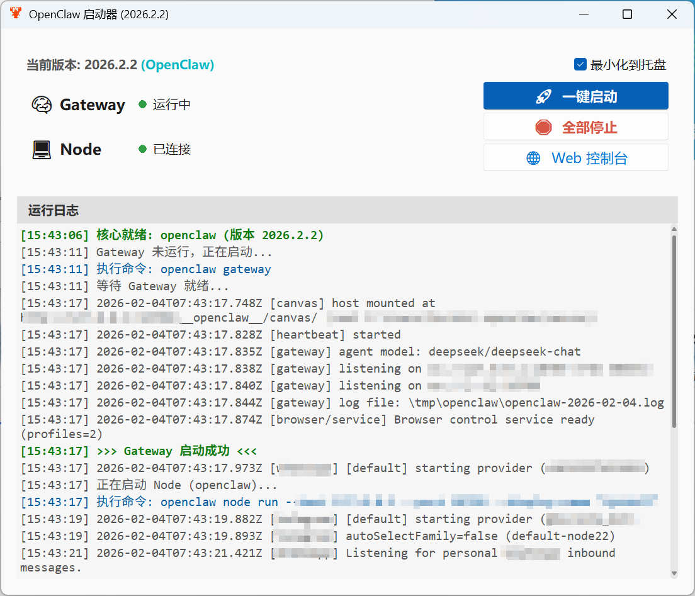
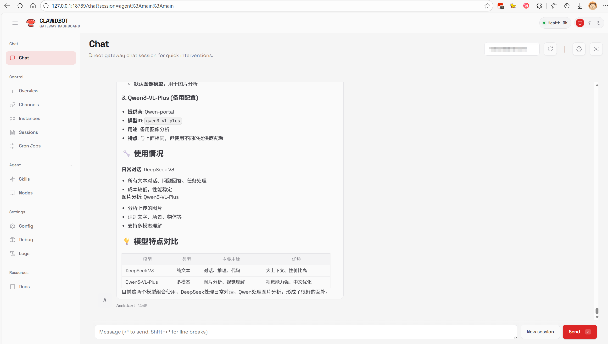
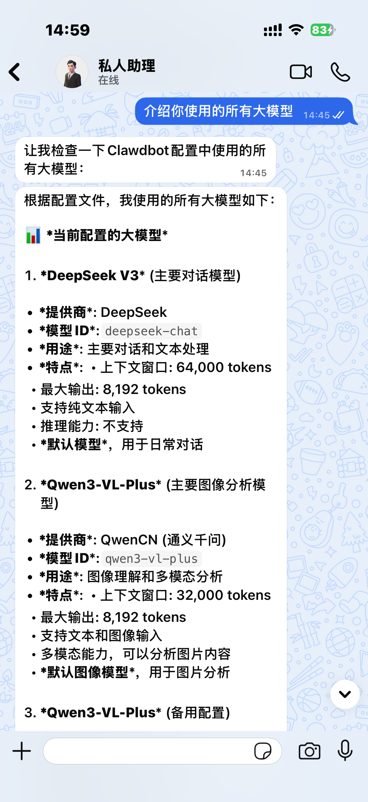

# 🦞 Openclaw 使用教程

> **最后更新:** 2026-02-04 (适配 Launcher v1.2)

---

## 📘 目录

* [一、 简介](#intro)
* [二、 系统要求](#requirements)
* [三、 🚀 使用 Openclaw Launcher](#launcher)
* [四、 💻 向导配置](#install)
* [五、 🔑 大模型配置](#apikey-config)
* [六、 🛠️ 常用命令](#commands)
* [七、 ✅ 验证配置文件](#verify)
* [八、 📂 文件结构与安全建议](#structure)
* [九、 ❓ FAQ](#faq)

---

## <span id="intro">一、 简介</span>

Openclaw 是一个开源的本地 AI 助手枢纽，它允许你将最顶尖的 AI 模型（如 DeepSeek-V3/R1、Qwen-Turbo）无缝接入 WhatsApp、Telegram 等平台，同时确保数据隐私。

---

## <span id="requirements">二、 系统要求</span>

* **Node.js**: **22.0.0** 或更高版本 (强烈推荐使用 `nvm` 管理)
* **操作系统**: Windows

---

## <span id="launcher">三、 🚀 Openclaw Launcher</span>

**🦞 Openclaw Launcher (v1.2)**

此软件旨在简化 openclaw 的部署与管理流程，无需使用命令行启动相关 openclaw 服务。v1.2 版本引入了全新的事件驱动架构与智能管理功能。

> **📸 界面预览**

<div align="center">

<p><em>▲ v1.2 新界面：支持双版本显示、三色状态灯与智能控制台</em></p>
</div>

### 🎉 核心亮点 (Highlights)

* **🏷️ 双核自动识别**：
* 自动检测系统中安装的是 `OpenClaw` 原版还是 `OpenClaw-CN` 中文版。
* 标题栏与界面实时显示当前核心版本号（例如：`2026.2.5`）。


* **⚡ 极速状态反馈**：
* 采用 **事件驱动 (Event-Driven)** 机制，服务启动或连接成功的瞬间状态灯立即响应，告别轮询延迟。


* **🧠 智能 WebUI 管理**：
* **首次启动**：自动执行鉴权命令，生成带 Token 的 URL 实现自动登录。
* **后续启动**：直连本地接口 (`127.0.0.1:18789`)，秒开控制台。


* **📂 目录洁癖友好**：
* 配置文件自动迁移至 `%LOCALAPPDATA%`，保持 EXE 所在目录绝对纯净。


* **🛡️ 托盘守护**：支持“最小化到托盘”，关闭窗口后自动缩入右下角，全天候守护您的 AI 服务。

### 🕹️ 操作指南

1. **一键启动**：点击“🚀 一键启动”，软件会自动按顺序拉起 Gateway 和 Node 服务。
2. **状态监控**：
* **⚪ 灰色**：服务未运行或已停止。
* **🟡 黄色**：服务正在启动或正在建立连接（中间状态）。
* **🟢 绿色**：
* **Gateway**: HTTP 服务已就绪 (200 OK)。
* **Node**: 已成功连接到网关 (Connected)。


3. **Web 控制台**：
* 等待双灯变绿后，点击“🌐 Web 控制台”。首次点击会自动完成 Token 鉴权，无需手动复制粘贴。


---

## <span id="install">四、 💻 向导配置</span>

如部分功能需要通过终端控制，请参考本章节。

### 1. 安装工具

```bash
npm install -g openclaw


```

### 2. 启动配置向导

```bash
openclaw onboard


```

### 3. 配置步骤

#### 3.1 启动模式与安全确认

```text
◇  Security ... I understand this is powerful and inherently risky. Continue?
│  Yes

◇  Onboarding mode
│  QuickStart  ← 选择此项


```

#### 3.2 配置 AI 模型

这里我们跳过内置提供商，手动指定模型名称。

```text
◇  Model/auth provider
│  Skip for now  ← 必选此项！(后续手动填 Key)

◇  Filter models by provider
│  All providers

◇  Default model
│  Enter model manually  ← 选择手动填写

◇  Default model
│  deepseek/deepseek-chat


```

> **📝 大模型选择：**
> * **DeepSeek **: 输入 `deepseek/deepseek-chat`
> * **DeepSeek 深度思考**: 输入 `deepseek/deepseek-reasoner`
> * **阿里云 Qwen**: 建议输入 `qwencn/qwen-vl-plus` (不要用 qwen 开头，原因见第五章)
> 
> 

#### 3.3 配置聊天渠道

##### 🟢 选项 A：配置 WhatsApp

```text
◇  Select channel (QuickStart)
│  WhatsApp (QR link)

◇  WhatsApp phone setup
│  Separate phone just for Clawdbot

◆  WhatsApp DM policy
│  Pairing (recommended)

◆  WhatsApp allowFrom
│  Set allowFrom to specific numbers

◆  Allowed sender numbers
│  +8618888888888  ← 输入你的手机号(带国家码)


```

##### 🔵 选项 B：配置 Telegram

**准备工作：**

1. 在 Telegram 搜索 **@BotFather**，发送 `/newbot` 获取 **Bot Token**。
2. 搜索 **@userinfobot**，获取你的 **User ID** (纯数字)。

**向导操作：**

```text
◇  Select channel (QuickStart)
│  Telegram (Bot API)

◇  Paste Telegram bot token
│  123456:ABC-DEF1234ghIkl...  ← 粘贴 Token

◇  Telegram whitelist (optional)
│  123456789  ← 填入 User ID


```

#### 3.4 配置技能 (Skills)

暂时跳过，后续可按需添加。

```text
◇  Skills status ────────────╮
│                            │
│  Eligible: 5               │
│  Missing requirements: 44  │
│  Blocked by allowlist: 0   │
│                            │
├────────────────────────────╯
│
◆  Configure skills now? (recommended)
│  ○ Yes / ● No   ← 选择 No 跳过


```

#### 3.5 配置钩子 (Hooks) - 开启记忆

开启 Session Memory 以便机器人能记住对话上下文。

```text
◇  Hooks ──────────────────────────────────────────────────────────╮
│  Hooks let you automate actions when agent commands are issued.  │
│  Example: Save session context to memory when you issue /new.    │
├──────────────────────────────────────────────────────────────────╯
│
◆  Enable hooks?
│  ◻ Skip for now
│  ◻ 🚀 boot-md
│  ◻ 📝 command-logger
│  ◼ 💾 session-memory  ← 按空格键勾选此项 (变成实心方块)


```

#### 3.6 启动网关服务 (Gateway)

这一步会启动后台服务，请留意弹出的新窗口日志。

```text
◇  Gateway service runtime ────────────────────────────────────────────╮
│  QuickStart uses Node for the Gateway service (stable + supported).  │
├──────────────────────────────────────────────────────────────────────╯
│
◆  Gateway service already installed
│  ● Restart  ← 选择重启服务
│  ○ Reinstall
│  ○ Skip


```

**(此时会弹出新的命令行窗口，显示如下日志即代表启动成功)**

```text
06:41:41 [gateway] agent model: deepseek/deepseek-chat
06:41:41 [gateway] listening on ws://127.0.0.1:18789
06:41:41 [hooks] loaded 3 internal hook handlers
06:41:41 [whatsapp] [default] starting provider (+86153***********)
06:41:44 [whatsapp] Listening for personal WhatsApp inbound messages.
Ctrl+C to stop.


```

#### 3.7 完成并打开界面

最后一步，进入 Web UI 确认状态。

```text
◆  How do you want to hatch your bot?
│  ○ Hatch in TUI (recommended)
│  ● Open the Web UI  ← 选择此项打开网页版
│  ○ Do this later


```

---

## <span id="apikey-config">五、🔑 大模型配置</span>

**注意：** 无论使用 Launcher 还是命令行，初次配置都需要手动填入 Key。

### ⚠️ Qwen (通义千问) 注意！

> 如果使用**国内版** API Key，配置文件中的 provider 名字**不能叫 `qwen**`！
> * **原因**：Openclaw 会将 `qwen` 强制重定向到国际版接口，导致 `401 Unauthorized`。
> * **解决**：请自定义名字为 **`qwencn`** 或 `qwenchina`等。
> 
> 

### 操作步骤

1. **打开配置文件**：

* Windows: `C:\Users\你的用户名\.openclaw\openclaw.json`

2. **修改 `models` 部分** ：

#### 🅰️ 方案 A：使用 DeepSeek

> 🔗 **[点击这里获取 DeepSeek API Key](https://platform.deepseek.com/api_keys)**

```json
{
  "models": {
    "mode": "merge",
    "providers": {
      "deepseek": {
        "baseUrl": "https://api.deepseek.com/v1",
        "apiKey": "填入你的deepseek的Key",
        "api": "openai-completions",
        "models": [
           {
             "id": "deepseek-chat",
             "name": "deepseek-chat",
             "input": ["text"]
           }
        ]
      }
    }
  },
  "agents": {
    "defaults": {
      "model": { "primary": "deepseek/deepseek-chat" }
    }
  }
}


```

#### 🅱️ 方案 B：使用阿里云 Qwen (国内版)

> 🔗 **[点击这里获取阿里云百炼 API Key](https://dashscope.console.aliyun.com/apiKey)**
> *(注意：名字必须叫 qwencn，不要改回 qwen)*

```json
{
  "models": {
    "mode": "merge",
    "providers": {
      "qwencn": {
        "baseUrl": "https://dashscope.aliyuncs.com/compatible-mode/v1",
        "apiKey": "sk-你的阿里云Key",
        "api": "openai-completions",
        "models": [
           {
             "id": "qwen-vl-plus",
             "name": "Qwen VL",
             "input": ["text", "image"]
           }
        ]
      }
    }
  },
  "agents": {
    "defaults": {
      "model": { "primary": "qwencn/qwen-plus" },
      "imageModel": { "primary": "qwencn/qwen-vl-plus" }
    }
  }
}


```

3. **重启服务生效**：

* **Launcher用户**: 点击界面上的 Restart 按钮。
* **命令行用户**: 执行 `openclaw gateway restart`。

---

## <span id="commands">六、 🛠️ 常用命令速查手册</span>

### 6.1 Gateway 管理

* `openclaw channels status` : 查看状态
* `openclaw gateway restart` : 重启服务 (改配置后必做)
* `openclaw channels status --deep` : 深度连接检查

### 6.2 诊断与日志

* `tail -f ~/.openclaw/logs/gateway.log` : 查看主日志
* `tail -f /tmp/openclaw/openclaw-$(date +%Y-%m-%d).log` : 查看详细 API 日志
* `openclaw doctor --fix` : 自动修复问题

### 6.3 界面与更新

* `openclaw dashboard` : 打开 Web UI
* `openclaw tui` : 打开终端聊天界面
* `npm install -g openclaw@latest` : 更新版本

---

## <span id="verify">七、 ✅ 验证配置文件</span>

### 1. 访问 Web UI 确认运行

打开浏览器访问 `http://127.0.0.1:18789`。
如果看到如下界面，说明 openclaw 网关已成功启动，DeepSeek 和 Qwen 模型加载正常。

<div align="center">

<p><em>▲ openclaw Web UI 控制台：显示 DeepSeek V3 与 Qwen3-VL-Plus 配置就绪</em></p>
</div>

### 2. WhatsApp 测试

拿起手机，向配置好的 WhatsApp 机器人发送消息：`介绍你使用的所有大模型`。
如下图所示，机器人能够精准调用 DeepSeek 进行文本回复，并列出当前的配置详情。

<div align="center">

<p><em>▲ WhatsApp 实测：成功调用 DeepSeek V3 进行流畅对话</em></p>
</div>

---

## <span id="structure">八、 📂 文件结构与安全建议</span>

### 8.1 配置文件位置

```text
~/.openclaw/
├── openclaw.json              # [核心] 主配置文件
├── credentials/               # API 凭证存储
├── sessions/                  # 全局会话数据
└── logs/                      # 日志文件夹


```

### 8.2 安全最佳实践

* **API Key**: 推荐使用 `openclaw.json` 本地配置，禁止提交到 Git。
* **访问控制**: Gateway 默认只监听 `localhost`。如需远程控制，请使用 **Tailscale** 连回本地，严禁直接暴露端口到公网。

---

## <span id="faq">九、❓ FAQ</span>

* **Q: 为什么 Qwen 报错 401？**
* A: 检查配置文件中 provider 名字是否写成了 `qwen`。如果是，请改为 `qwencn`。
* **Q: Telegram 机器人没反应？**
* A: 确认配置文件或向导中填写的 User ID 正确。
* **Q: WhatsApp 怎么配对？**
* A: 启动后用白名单手机号发消息，如提示配对，在命令行输入 `clawdbot pairing approve whatsapp <配对码>`。
