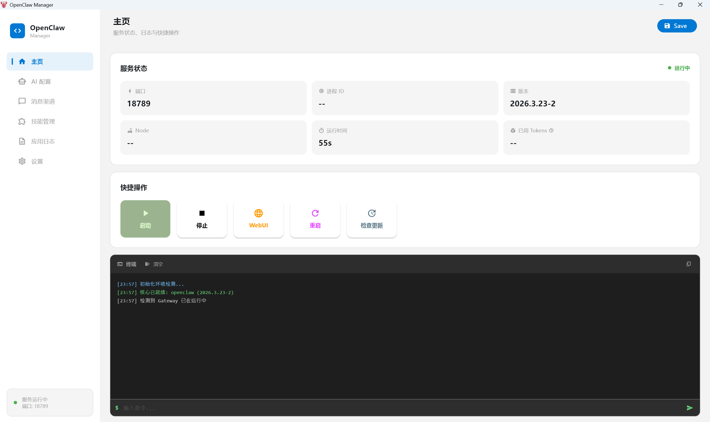
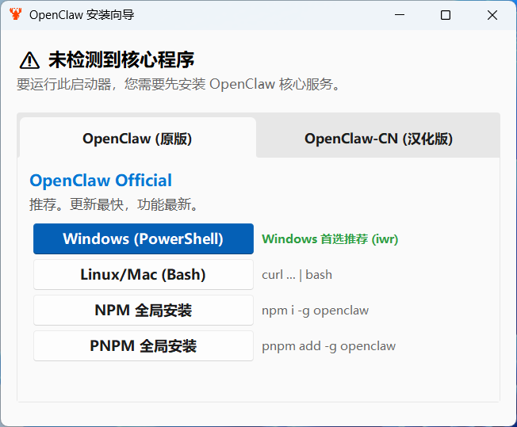
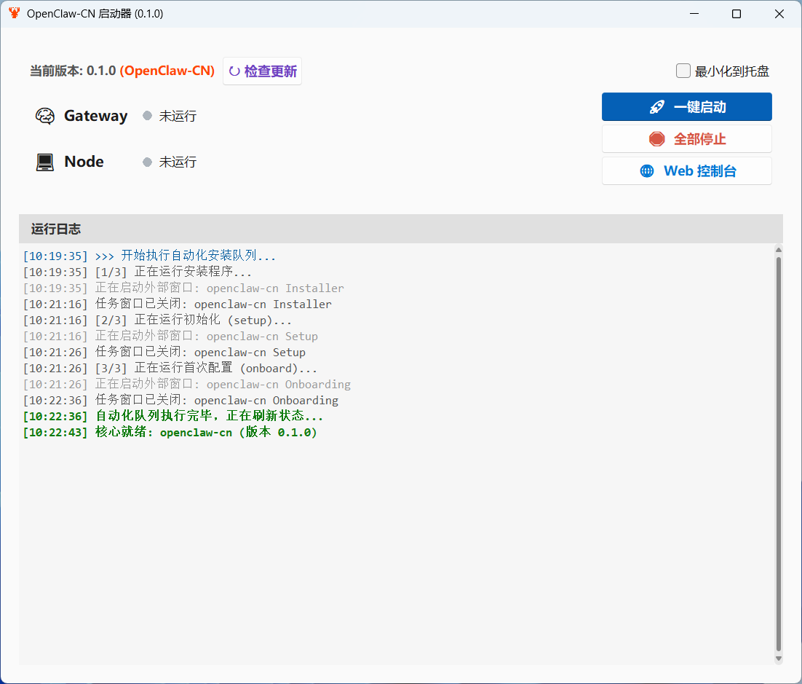

# 🦞 OpenClaw Launcher

**OpenClaw Launcher** 是一个专为 [OpenClaw](https://openclaw.ai/) 设计的图形化管理工具，基于 Flutter 开发，提供一站式的安装、部署、监控和管理体验。

无论您是开发者还是普通用户，通过此启动器，无需记忆复杂的 CLI 指令，即可轻松管理您的 AI 算力网络节点。

<div align="center">
  
</div>

---

## ✨ 核心功能

* **一键启动**：点击按钮自动按顺序启动 Gateway 和 Node 服务。
* **智能检测**：自动检测 Gateway 是否已运行，避免重复启动。
* **实时监控**：
    * 实时显示 Gateway 与 Node 的运行状态（红绿灯指示）。
    * 日志窗口实时输出后台信息。
* **Token 统计**：自动获取并显示当前会话的 Token 使用量，每 10 分钟自动刷新。
* **主题切换**：支持亮色/深色/跟随系统主题。
* **开机自启动**：支持 Windows 注册表开机自启。
* **跨平台打包**：基于 Flutter，支持 Windows 便携式打包。

---

## 📖 使用方法

### 1. 运行环境

*(如果您下载的是打包好的 `.exe` 文件，则无需安装任何依赖，直接双击运行即可)*

如需从源码运行，请确保安装 Flutter SDK：
```bash
flutter pub get
flutter run
```

### 2. 首次使用

1. 启动软件，程序会自动检测系统环境：
    * 检测 Node.js 是否安装
    * 检测 OpenClaw 核心是否安装
    * 检测 Gateway 是否已运行
2. 若未检测到核心，会提示前往设置页进行安装。

<div align="center">

</div>

3. **安装 OpenClaw**：在设置页点击安装按钮，推荐使用 **Windows (PowerShell)** 安装方式。

<div align="center">

</div>

### 3. 日常使用

* **🚀 一键启动**：点击主界面按钮，程序会自动按顺序启动 Gateway 和 Node 服务。
* **🌐 Web 控制台**：服务启动成功（指示灯变绿）后，点击此按钮可直接打开浏览器进入管理后台。
* **🛑 全部停止**：一键关闭所有相关后台进程，释放系统资源。
* **📊 Token 统计**：服务启动后自动显示当前会话的 Token 使用量（Input + Output）。
* **↻ 手动刷新**：可随时手动刷新 Token 统计信息。
* **🎨 主题切换**：在设置页可切换亮色/深色/系统主题。
* **⚡ 开机自启动**：在设置页可开启/关闭开机自启动功能。

---

## 🔧 常见问题与解决 (Troubleshooting)

**Q1: 启动时提示 "Port 18789 is already in use"？**

> **A:** 这表示 Gateway 已经在运行中（可能是您手动启动的）。新版本会自动检测并复用已运行的 Gateway，无需手动停止。

**Q2: Token 统计显示 "--"？**

> **A:** Token 统计依赖于 `openclaw status --json` 命令的输出。请确保 Gateway 和 Node 都正常运行后，等待几秒会自动刷新。

**Q3: 开机自启动不生效？**

> **A:** 请确保以管理员权限运行过一次启动器，以便写入注册表。自启动功能使用 Windows 注册表 `HKEY_CURRENT_USER\Software\Microsoft\Windows\CurrentVersion\Run` 实现。

**Q4: 如何打包成便携式 exe？**

> **A:** 运行以下命令：
> ```bash
> flutter build windows --release
> ```
> 生成的 exe 在 `build\windows\x64\release\bundle\` 目录下，该目录即为便携式版本。

---

## 📝 更新日志

### v1.0.0 (Flutter 重构版)
* 基于 Flutter 重构，跨平台支持
* 新增 Token 使用量统计功能
* 新增 Gateway 自动检测功能
* 新增主题切换功能
* 新增开机自启动功能
* 优化日志显示体验
